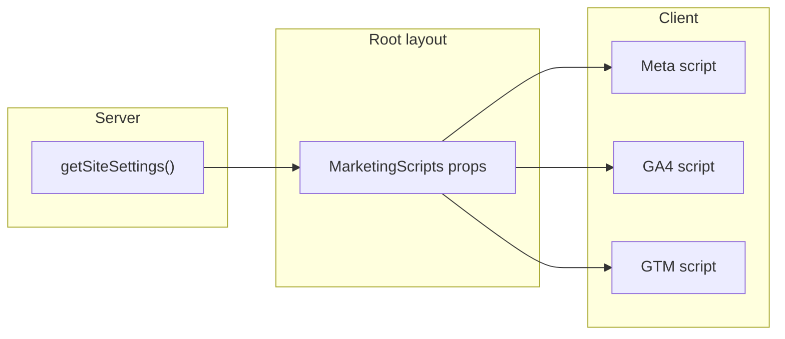

# Marketing Integration System

## Current state

- **Meta Pixel**: Loaded in [app/components/FacebookPixel.tsx](app/components/FacebookPixel.tsx) using `NEXT_PUBLIC_FB_PIXEL_ID`; [lib/facebook-pixel.ts](lib/facebook-pixel.ts) exposes `trackViewContent`, `trackAddToCart`, `trackInitiateCheckout`, `trackPurchase` (Meta only).
- **Event call sites**: [app/components/ProductDetailClient.tsx](app/components/ProductDetailClient.tsx) (ViewContent), [context/CartContext.tsx](context/CartContext.tsx) (AddToCart), [app/checkout/CheckoutForm.tsx](app/checkout/CheckoutForm.tsx) (InitiateCheckout), [app/checkout/CheckoutSuccess.tsx](app/checkout/CheckoutSuccess.tsx) (Purchase).
- **Settings**: [lib/site-settings.ts](lib/site-settings.ts) defines `SiteSettings` and `getSiteSettings()`; [app/actions/settings.ts](app/actions/settings.ts) updates `site_settings` via Server Action. [app/layout.tsx](app/layout.tsx) does not pass settings to body (only `generateMetadata` uses `getSiteSettings()`).

---

## 1. Database layer (Supabase)

**New migration** (e.g. `00018_marketing_tracking.sql`):

- Add to `site_settings`: `meta_pixel_id TEXT`, `ga4_measurement_id TEXT`, `gtm_container_id TEXT`, `tracking_enabled BOOLEAN DEFAULT true`.
- No backfill needed; existing row will get defaults.

---

## 2. Settings type and loader

**File: [lib/site-settings.ts](lib/site-settings.ts)**

- Extend `SiteSettings` with `meta_pixel_id`, `ga4_measurement_id`, `gtm_container_id`, `tracking_enabled` (all nullable/boolean with defaults: `null`, `null`, `null`, `true`).
- In `getSiteSettings()`, map these four columns from the single row and merge with defaults so they are always present in the returned object.

---

## 3. Server Action for marketing settings

**File: [app/actions/settings.ts](app/actions/settings.ts)**

- Extend `updateSiteSettings` form type and payload handling for: `meta_pixel_id`, `ga4_measurement_id`, `gtm_container_id`, `tracking_enabled`.
- Trim text fields; coerce `tracking_enabled` to boolean. Optionally add `revalidatePath("/dashboard/marketing")`.

---

## 4. Dashboard UI: `/dashboard/marketing`

- **New page**: [app/dashboard/marketing/page.tsx](app/dashboard/marketing/page.tsx) — server component that fetches `getSiteSettings()` and renders a client form with:
  - Meta Pixel ID (text input)
  - Google Analytics Measurement ID (text input)
  - Google Tag Manager Container ID (text input)
  - Enable tracking (toggle, binds to `tracking_enabled`)
- **New client form**: e.g. `app/dashboard/marketing/MarketingForm.tsx` — form that calls `updateSiteSettings` with the four fields, success/error feedback (e.g. sonner).
- **Sidebar**: In [app/dashboard/DashboardSidebar.tsx](app/dashboard/DashboardSidebar.tsx), add a nav item (e.g. "Marketing" or "Tracking") with icon (e.g. `Megaphone` or `BarChart3`) linking to `/dashboard/marketing`, placed appropriately (e.g. above Paramètres/Aide).

---

## 5. Global script loader (layout)

**Constraint**: Scripts must be loaded only when `tracking_enabled === true` and when the corresponding ID is set; strategy `afterInteractive`.

**Approach**:

- **Root layout** [app/layout.tsx](app/layout.tsx): Call `getSiteSettings()` in the default export (alongside existing data). Pass a subset of settings into a **client** component that will render scripts:
  - `meta_pixel_id`, `ga4_measurement_id`, `gtm_container_id`, `tracking_enabled`.
- **New client component**: e.g. [app/components/MarketingScripts.tsx](app/components/MarketingScripts.tsx) (replacing or wrapping the current `FacebookPixel` usage):
  - Props: `{ tracking_enabled, meta_pixel_id, ga4_measurement_id, gtm_container_id }`.
  - If `!tracking_enabled`, render nothing.
  - Otherwise, for each provided ID, render one `next/script` with `strategy="afterInteractive"`:
    - **Meta**: same snippet as current [app/components/FacebookPixel.tsx](app/components/FacebookPixel.tsx), but pixel ID from props.
    - **GA4**: load `https://www.googletagmanager.com/gtag/js?id=${ga4_measurement_id}` and init `gtag('config', id)` + `gtag('event', 'page_view')` (or rely on GTM if both are used).
    - **GTM**: load GTM script by container ID (head + body noscript as per GTM docs).
- Remove the existing `<FacebookPixel />` from layout and any reliance on `NEXT_PUBLIC_FB_PIXEL_ID` for the main pixel.

**Data flow**:

---

## 6. Unified event layer: `lib/marketing-events.ts`

**New file: [lib/marketing-events.ts](lib/marketing-events.ts)**

- **Types**: Define minimal event payload types (product_id, product_name, category, variant, price, currency "DZD", quantity, order_value, order_id where relevant).
- **Global declarations**: Extend `Window` for `fbq`, `gtag`, `dataLayer` (for GTM).
- **Functions** (all client-safe; check `typeof window !== "undefined"` and presence of each API before calling):
  - `trackViewProduct(product)` → Meta `ViewContent`; GA4 `view_item`; push to `dataLayer` for GTM (e.g. `view_item` + Meta event name).
  - `trackAddToCart(product, variant, quantity)` → Meta `AddToCart`; GA4 `add_to_cart`; dataLayer.
  - `trackCheckout(cart)` → Meta `InitiateCheckout` (value, num_items); GA4 `begin_checkout` (items, value); dataLayer.
  - `trackPurchase(order)` → Meta `Purchase` (order_id, value); GA4 `purchase` (transaction_id, value, items); dataLayer.
- **Payload**: Use `product_id`, `product_name`, `category` (from product or cart item), `variant` (label or id), `price`, `currency: "DZD"`, `quantity`, `order_value` / `order_id` as specified. Map existing `Product`, `CartItem`, and order summary types into these payloads inside the functions or via small adapters.

**Deprecation**: After migration, remove or re-export from [lib/facebook-pixel.ts](lib/facebook-pixel.ts) so call sites use only `lib/marketing-events.ts`.

---

## 7. Trigger events in pages

- **Product page** [app/components/ProductDetailClient.tsx](app/components/ProductDetailClient.tsx): Replace `trackViewContent` from `facebook-pixel` with `trackViewProduct(product)` from `marketing-events`. Pass full product (include `categories?.name` for category, and optional selected variant for variant).
- **Add to cart** [context/CartContext.tsx](context/CartContext.tsx): Replace `trackAddToCart` from `facebook-pixel` with `trackAddToCart(product, variant, quantity)` from `marketing-events`. CartContext has `CartItem` (productId, name, price, variantId, variantLabel, quantity); either pass a minimal product shape + variant + quantity, or extend `trackAddToCart` to accept a cart-line shape (product_id, product_name, category, variant, price, quantity).
- **Checkout page** [app/checkout/CheckoutForm.tsx](app/checkout/CheckoutForm.tsx): Replace `trackInitiateCheckout` with `trackCheckout(cart)` from `marketing-events`. Pass current `items` and total (e.g. `{ items, totalDzd }`).
- **Order success** [app/checkout/CheckoutSuccess.tsx](app/checkout/CheckoutSuccess.tsx): Replace `trackPurchase` from `facebook-pixel` with `trackPurchase(order)` from `marketing-events`. Pass `{ orderId, value, items? }` so both Meta/GA4 can receive order_value and items if needed.

Cart and checkout currently do not have `category` on `CartItem`; either add it when adding to cart (from product) or pass optional category into the event and leave it empty when not available. Prefer adding category to cart item at add-time so events stay consistent.

---

## 8. Documentation for marketing team

- **New page**: [app/dashboard/aide/marketing/page.tsx](app/dashboard/aide/marketing/page.tsx) — static (or server) content page explaining:
  - Where to find and paste Meta Pixel ID, GA4 Measurement ID, GTM Container ID (dashboard → Marketing).
  - What each script does and that tracking can be toggled off.
  - How events work: ViewContent / view_item, AddToCart / add_to_cart, InitiateCheckout / begin_checkout, Purchase / purchase.
  - How to verify: Meta Events Manager, GA4 Realtime, Google Tag Assistant.
- **Link from main Aide**: In [app/dashboard/aide/page.tsx](app/dashboard/aide/page.tsx), add a section or link to "Marketing et suivi" → `/dashboard/aide/marketing`.

---

## 9. Testing

- Manual: Enable tracking and set test IDs; use Meta Events Manager, GA4 Realtime, and Tag Assistant to confirm events and page_view.
- No new automated tests required by the plan; optional E2E could be added later.

---

## 10. Future extensions (architecture only)

- **DB**: Optional later migration for `tiktok_pixel_id`, `snapchat_pixel_id`, or a JSONB `tracking_config` for extra pixels and Conversion API flags.
- **Script loader**: In [app/components/MarketingScripts.tsx](app/components/MarketingScripts.tsx), keep a single place where scripts are conditionally injected so adding TikTok/Snap is a small change.
- **Events**: [lib/marketing-events.ts](lib/marketing-events.ts) should push a consistent payload to `dataLayer`; GTM can handle TikTok, Snap, CAPI, affiliate tags via tags/triggers. No code change required for GTM-based extensions; for server-side CAPI, a separate API route or server action would be added later.

---

## File checklist

| Action           | File                                                                          |
| ---------------- | ----------------------------------------------------------------------------- |
| Create           | `supabase/migrations/00018_marketing_tracking.sql`                            |
| Edit             | `lib/site-settings.ts` (types + getSiteSettings)                              |
| Edit             | `app/actions/settings.ts` (updateSiteSettings)                                |
| Create           | `app/dashboard/marketing/page.tsx`                                            |
| Create           | `app/dashboard/marketing/MarketingForm.tsx`                                   |
| Edit             | `app/dashboard/DashboardSidebar.tsx` (nav item)                               |
| Edit             | `app/layout.tsx` (fetch settings, pass to MarketingScripts)                   |
| Create           | `app/components/MarketingScripts.tsx`                                         |
| Remove           | `app/components/FacebookPixel.tsx` from layout (delete or keep for reference) |
| Create           | `lib/marketing-events.ts`                                                     |
| Edit             | `app/components/ProductDetailClient.tsx` (trackViewProduct)                   |
| Edit             | `context/CartContext.tsx` (trackAddToCart from marketing-events)              |
| Edit             | `app/checkout/CheckoutForm.tsx` (trackCheckout)                               |
| Edit             | `app/checkout/CheckoutSuccess.tsx` (trackPurchase)                            |
| Deprecate/remove | `lib/facebook-pixel.ts` (re-export or delete after migration)                 |
| Create           | `app/dashboard/aide/marketing/page.tsx`                                       |
| Edit             | `app/dashboard/aide/page.tsx` (link to marketing help)                        |

---

## Optional: CartItem and category

To send `category` in AddToCart and begin_checkout, extend [context/CartContext.tsx](context/CartContext.tsx) `CartItem` with an optional `category?: string` and set it in `addItem` when the caller provides it. Update [app/components/ProductDetailClient.tsx](app/components/ProductDetailClient.tsx) and any other add-to-cart call sites to pass category from the product. This keeps event payloads aligned with the spec without large refactors.